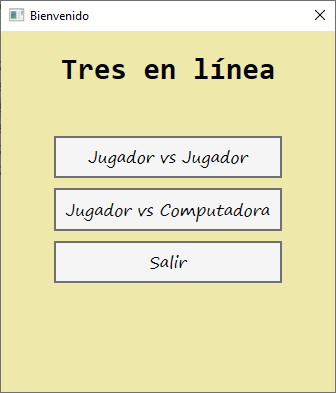
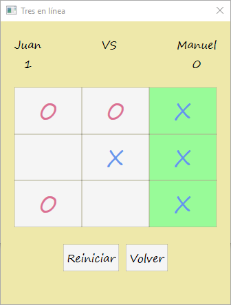

# tictactoe-minimax

Repositorio para el juego "Tres en línea". 

La idea de este proyecto es implementar el teorema minimax cuando se quiere jugar contra la computadora.

### Ventana de bienvenida

  En esta ventana se puede seleccionar el modo de juego.
  

### Jugador vs Jugador

  Los jugadores ingresan sus nombres.
  

### Juego

  Se muestra el tablero de juego, junto con el puntaje de ambos jugadores. 
    

