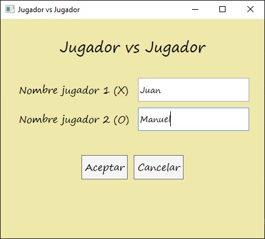

# tictactoe-minimax

Repositorio para el juego "Tres en línea". 

La idea de este proyecto es implementar el teorema minimax cuando se quiere jugar contra la computadora.

### Ventana de bienvenida

En esta ventana se puede seleccionar el modo de juego.

### Jugador vs Jugador

Los jugadores ingresan sus nombres.

### Juego

Se muestra el tablero de juego, junto con el puntaje de ambos jugadores. 
